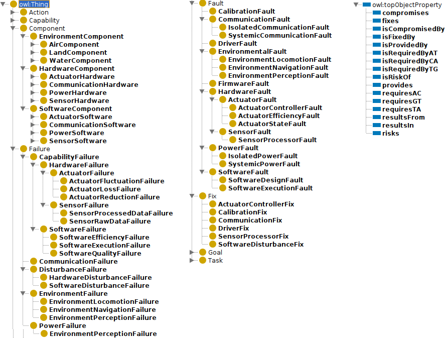

# remaro_ontologies

A repository of ontologies developed as part of the REMARO project.

## Acknowledgements

<a href="https://remaro.eu/">
    
</a>

This work is part of the Reliable AI for Marine Robotics (REMARO) Project. For more info, please visit: <a href="https://remaro.eu/">https://remaro.eu/

<br>

<a href="https://research-and-innovation.ec.europa.eu/funding/funding-opportunities/funding-programmes-and-open-calls/horizon-2020_en">
    
</a>

This project has received funding from the European Union's Horizon 2020 research and innovation programme under the Marie Skłodowska-Curie grant agreement No. 956200.

## Ontologies

### FailFaultFix.owl

<a href="https://github.com/">
    
</a>

This ontology was developed as part of the following work:

```
@inproceedings{coffelt2022belief,
  title={Belief-based fault recovery for marine robotics},
  author={Coffelt, Jeremy Paul and Kashani, Mahya Mohammadi and Wasowski, Andrzej and Kampmann, Peter},
  booktitle={The Eighth Joint Ontology Workshops (JOWO’22), J{\"o}nk{\"o}ping University, Sweden},
  year={2022}
}
```
